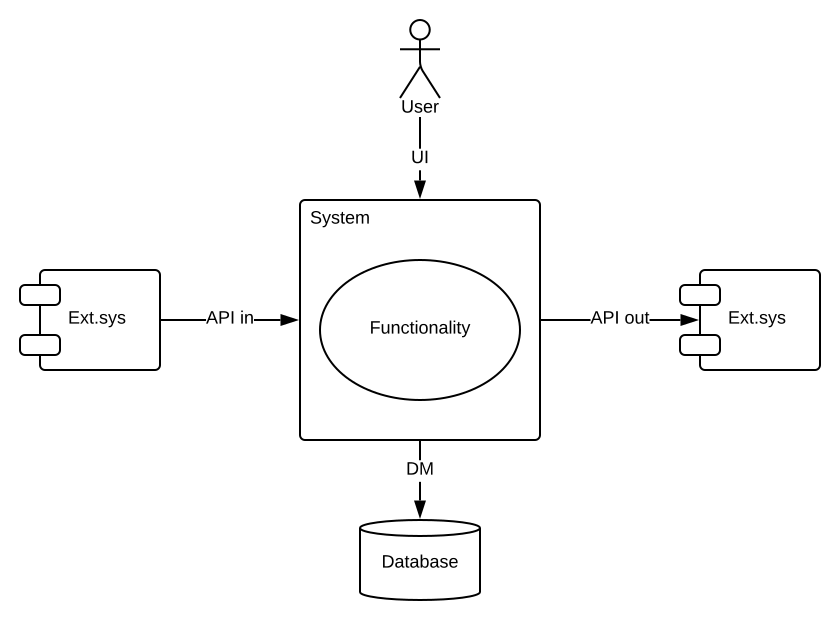

## The case for   Functional Specification

<!-- .element: style="margin-bottom: 5rem;" -->

Upgrade your project,
 
start writing light-weight FSD now!

<!-- .element: style="margin-bottom: 5rem;" -->

> Ivo Maixner  
> ivo.maixner@gmail.com

^^^^

## About me

- 24 projects in 24 years
- Projects and companies tiny to big
- Programmer, analyst, tester, ops, support, team&nbsp;lead
- Waterfall, iterative, RUP, Scrum, "No process"

<!-- .element: class="fragment" height="180" -->

Notes:
- First custom program: Sort car race results (~ '87)
- First paid program: Tooling workshop IS (~ '89)
- SW dev full-time since '95
- (Basic, Pascal, C++), Java, Clojure, Javascript, (Python)
- Java since v. 1.1 at the end of '97.
- Doing a waterfall project in the age of dinosaurs

^^^^

## Agenda

- Doing without analysis and FSD
- Analyst role defined
- Benefits of FSD
- FSD content
- Live demo writing FSD

^^^^

## Questions

- <!-- .element: class="fragment" --> Programmer: What do I implement today?
- <!-- .element: class="fragment" --> Tester: How do I know the app is correct?
- <!-- .element: class="fragment" --> Stakeholders: What do we get at the end?
- <!-- .element: class="fragment" --> User: Is this a bug? (or a feature?)
- <!-- .element: class="fragment" --> How to incorporate new feature into existing?

&Implies; Low team spirit <!-- .element: class="fragment" -->

Notes:
- Programmer:
    - “Find customer”. What exactly?
    - Entity, attributes, table columns, search criteria.
    - Infinite number of solutions. Which one? Guess one?
- Tester:
    - Verify the app is correct.
    - “Correct”? Click through, no errors? No!
    - Guess one too? Always different?
    - Fight programmer, who has the upper hand.
- Stakeholders:
    - Happy at start, feel not their responsibility.
    - At the end: we didn't ask for THIS! Not THIS way! You wasted the increment.
    - Your fault.
- Bug/feature:
    - App maintained 10x longer than built.
    - Feature in prod, sb. down the road
        bound to raise an issue: app does this
        but should be doing that &Implies; bug! Fix it! Your fault.
- What has to be changed in the system
    to incorporate this new feature into the existing functionality?
    - Fulfill all needs arising from the relations between features.
- When such questions pop up often,
    friction between team members, and with stakeholders.
    - People are not happy,
    - things gradually lose meaning,
    - causes lack of enthusiasm,
    - people get unconcerned,
    - team breaks down.

^^^^

## _Some_ projects...

^^^^

## The role of analyst

- <!-- .element: class="fragment" --> Grossly underappreciated nowadays
- <!-- .element: class="fragment" --> FSD deemed outdated, heavy-weight,  
    unnecessary
- <!-- .element: class="fragment" --> Agile: everything is cheap
- <!-- .element: class="fragment" --> Efficiency? Team spirit?

Notes:
- The role of the analyst seems grossly underappreciated nowadays.
    - FSD - thing from the past, when there were waterfalls and dinosaurs
    - Agile mentality, we believe anything is cheap
        - and can be delivered at the end of the next sprint.
    - And maybe it is.
    - But that doesn't say anything about efficiency of the development process.
        - You might be delivering new requirements every sprint,
        - but still be running in circles, not getting closer to your target.
    - If team inefficient:
        - members register, team spirit suffers

^^^^

## Teams without analyst

- <!-- .element: class="fragment" --> Re-think requirements every time
    - <!-- .element: class="fragment" --> Repeat hard work, different outcomes
- <!-- .element: class="fragment" --> Avoid thinking
    - <!-- .element: class="fragment" --> Dragged by never-ending changes and "bugs"

<!-- .element: class="fragment" height="180" -->

Notes:
- There are many teams **without analyst**,
    - Going only by the requirements,
        - expecting everybody to think things through anytime and every time they read any requirement,
        - rebuilding the idea in their heads, using it once and then dumping it again.
    - Repeating this hard-work process over and over,
        - with different outcome every time.

- Thinking is hard work, it hurts.

- Some teams **avoid the thinking** altogether,
    - accepting requirements as a stream of isolated items
    - never really connecting them within a single consistent idea of the whole system.
- End up being dragged by never ending changes in functionality,
    - often presented as “bugs.”
- Contradicting requirements may lead to recurring bugs,
    - where a “bug” repeatedly manifests itself.

- For programmers, scary.

^^^^

## What if...

...we **think** the req's through

AND **write** the result down  
to be re-used?

<!-- .element: class="fragment" height="220" -->

^^^^

## The analysis process

- Product owner: Knows what the system should do  
<!-- .element: class="fragment" -->
  &Implies; Requirements: ("we want")
    - high-level,
<!-- .element: class="fragment" -->
  partial,
  fragmented,
  contradictory,
  ever-changing
- Analyst: Thinks requirements through to the end  
<!-- .element: class="fragment" -->
  &Implies; Specification: ("the system should")
    - correct,
<!-- .element: class="fragment" -->
  complete,
  consistent,
  detailed

Notes:
- There's always a **product owner**, there's no product without him.
    - Knows the general direction and the ultimate goal or its vicinity,
    - drives the project there.

- Articulates **requirements**:
    - High-level: not detailed enough for implementation
    - Partial: there's always something missing
    - Fragmented: isolated items, not related together
    - Contradictory: oh yeah, baby
    - Ever-changing: the goal always changes over time
        - covertly in product owner's head,
        - development = shooting on a moving target

- It's the job of the **analyst** to think requirements through  
  to a full-blown comprehensive concept / idea:

- **Specification**: what the system should do - functionality
    - Correct: fulfills the requirements
    - Complete: covers the whole functionality of the feature
    - Consistent:
        - no contradictions or ambiguities,
        - within the system as a whole
    - Detailed: enough for implementation

^^^^

<!-- .slide: data-transition="fade" -->

## Analyst vs. programmer

- Analyst: functionality creativity
    - What should the system do to fulfill req's?
- Programmer: design creativity
    - How do we implement the functionality?
- <!-- .element: class="fragment separated" --> <u>Up-front</u>, written FSD = contract
    - &Implies; correct, complete, consistent, detailed

^^

<!-- .slide: data-transition="fade" -->

## Analyst vs. programmer

Example: _"List customers"_ screen

-  <!-- .element: class="fragment" -->Analyst:
    - <!-- .element: class="fragment" --> Table columns, search criteria, sort order
- <!-- .element: class="fragment" --> Programmer / compromise:
    - <!-- .element: class="fragment" --> Paging, date pick and/or enter
- <!-- .element: class="fragment" --> Programmer (designer, UI designer):
    - <!-- .element: class="fragment" --> UI fmwk, which date picker, async,  
    button vs. reload on typing, components

Notes:
- Analyst:
    - should there be customer web site column?
    - search by tax number? mobile? email?
    - search separated fields or one?
    - sort alphabetically by name or last updated first?
- Programmer / border - compromise:
    - affects the functionality
        - may interfere with the way the users want to use the system
    - first 100, paging, page size
    - search by Date created: support entering manually, pick, both?
- Programmer:
    - Bootstrap or Material design?
    - search by Date created: which date picker library?
    - asynchronicity: loader
    - button vs. reload on type:
        - Reload button? or
        - Reload automatically on typing?
    - components: design the implementation, support re-use

^^^^

<!-- .slide: data-transition="fade" -->

## Stakeholder feedback loop

#### Before

- <!-- .element: class="fragment" --> Planning: **accept the requirement**
- <!-- .element: class="fragment" --> During increment: ask A FEW questions
- <!-- .element: class="fragment" --> Time is up: guess a solution
- <!-- .element: class="fragment" --> Demo: hit or miss

&Implies; Feedback = increment **~ 2 weeks**

Notes:
- At planning meeting, requirement accepted into the increment.
- Devs start asking questions during development.
- Questions unfold themselves gradually.
- Time is up, before all q's asked.
- &Implies; deadline looming, the rest of open points: guess a solution

^^

<!-- .slide: data-transition="fade" -->

## Stakeholder feedback loop

#### After

- <!-- .element: class="fragment" --> Before planning: **analyze the requirement**
- <!-- .element: class="fragment" --> Hold a session, resolve a round of questions
- <!-- .element: class="fragment" --> Think
- <!-- .element: class="fragment" --> Create specification, repeat

&Implies; Feedback = FSD turnaround **< 1 day**

^^

<!-- .slide: data-transition="fade" -->

## Stakeholder feedback loop

Lesson learned:

- Decouple analytical and development lifecycle
- Pass spec (NOT req's) into development

^^^^

## Answers

- Programmer:
 What do I implement today?
 Check the specification
- Tester:
 How do I know the app is correct?
 Check the specification
- Stakeholders:
 What do we get at the end?
 Check the specification
- User:
 Is this a bug? (or a feature?)
 Check the specification
- How to incorporate new feature into existing?
  Check the specification

&Implies; High team spirit <!-- .element: class="fragment" -->

FSD = cornerstone of the whole project <!-- .element: class="fragment" -->

Notes:
- All of these q's suddenly resolved.
    - Might seem like a miracle, but it's not.
    - It's just applying proper engineering practise.
    - Just like writing tests,
        - or washing your hands after using the toilet.
- Everybody is literally “on the same page.”
    - No friction, no surprises.
    - People then tend to be happy,
    - and the team strong, cohesive.

^^^^

<!-- .slide: data-transition="fade" -->

## FSD

- <!-- .element: class="fragment" --> Data model (_entities, relations, attributes_)
- <!-- .element: class="fragment" --> UI (_screens, navigation, data, buttons_)
- <!-- .element: class="fragment" --> Functionality (_algorithms, validations_)
- <!-- .element: class="fragment" --> Provided APIs (_inbound op's, data structures_)
- <!-- .element: class="fragment" --> Called APIs (_outbound op's, data structures_)

Notes:
- Sorted by importance / priority

^^

<!-- .slide: data-transition="fade" -->

## FSD

<!-- .element: height="350" -->

Notes:
- FSD defines system boundaries,
- describes the system as a black box - from outside

^^^^

## Data model

- <!-- .element: class="fragment" --> Name key entities (nouns)
- <!-- .element: class="fragment" --> Draw relations between them (ERD)
- <!-- .element: class="fragment" --> Name attributes of the entities
- <!-- .element: class="fragment" --> Resolve data types and optionality
- <!-- .element: class="fragment" --> Think. Validate. Specify.

Notes:
- DM is THE single most important part of FSD.
    - It's the frame on which the whole FS is built,
    - also basis for implementation.
    - Always aim at the DM as the highest priority.
- If you can't get started, mock a couple of screens first to get some ideas.
- Look for nouns - entities.
- Sketch ERD for key entities and relations.
    - Then flesh-out entities with attributes.
- Think up a solution.
    - Validate it with the team, engage with white board.
    - Then write it down (and throw away the spike).

^^^^

## Screen mockups

- <!-- .element: class="fragment" --> Screens and navigation between them
- <!-- .element: class="fragment" --> Data: forms and fields, tables and columns
- <!-- .element: class="fragment" --> Action buttons
- <!-- .element: class="fragment" --> Functional notes

Notes:
- Functional notes: feasible for very simple functionality.
    - Use cases: are a topic for another talk.
- Use real-life sample data.
    - Add a touch of humor, make it fun.
- Focus on functionality only,
    - ignore UI design / looks: colors, fonts, layout
    - not relevant for functionality.
- Users want app nice, smooth and easy to use
    - any such design will do.
    - Functionality however is the unique way
        your product helps its users achieve more with less effort.
- If tool then try to find a tool for analysis, not UI design:
    - if it forces you to drag fields around the screen
    - then it's for designers not analysts,
    - just a distraction.

^^^^

## FSD indicators

- <!-- .element: class="fragment" --> Formal customer
- <!-- .element: class="fragment" --> Custom-built system
- <!-- .element: class="fragment" --> Testers, doc's, diverse roles
- <!-- .element: class="fragment" --> Hiring, expansion, fluctuation
- <!-- .element: class="fragment" --> Team size &GreaterEqual; 3

<!-- .element: class="fragment separated" --> Shack vs. house (skyscraper?!)

Notes:
- Hiring: tricky, might happen in future
    - FSD by definition written up-front,
    - re-create FSD ex-post almost impossible.
- As FSD is the foundation on which the project stands,
    - if you are building a shack, then maybe you don't care,
    - but if you are building a house, then some foundations might come handy

^^^^

## FSD anti-patterns

- <!-- .element: class="fragment" --> Overly formalized, heavy-weight
- <!-- .element: class="fragment" --> Contains design desicions
- <!-- .element: class="fragment" --> Brain death of team members ("coders")
- <!-- .element: class="fragment" --> Ex-post &Implies; partial
- <!-- .element: class="fragment" --> Not updated from impl &Implies; outdated

Notes:
- Formalized: 500 pages, generated from UML tools (EA)
- Brain death: FSD = no need to think anymore
    - Programmers MUST think, MUST understand the requirements
    - to make design decisions right

^^^^

## Conclusion

- Think it through.
- Put it down for reference.
- Implement from FSD only.

Notes:
- Once you do the hard thinking and construct the idea, don’t throw it away, put it down.
    - You will definitely need it many times over.
    - Write it down and then just use it.
- It doesn't have to be hundreds of pages of incomprehensible content.
    - Might be pretty light-weight and quick to put together,
    - yet providing immense benefit to the team and the project.

^^^^

## References

- Image credits: [Giphy.com](https://giphy.com), [Imgur.com](https://Imgur.com)
- FSD tool: [CaseFu.com](https://casefu.com)
